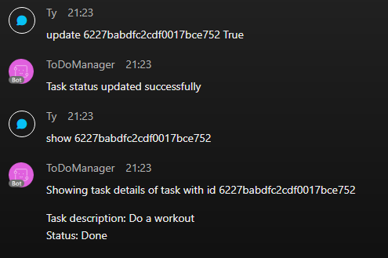

# ToDoManager Bot

ToDoManager is a bot that allows users of Webex to manage their To Do list with a few simple commands. To store the user details and the list, as well as to handle http request existing API was used which description can be found here -> https://documenter.getpostman.com/view/8858534/SW7dX7JG#intro

## Bot features

User can create an account, login or logout. Once they are logged in, it is possible to display all previously added tasks, change their status to *Done* or *To Do* as well as delete them from the list.

## Available commands

Following commands can be used to communicate with the bot.

### **help**

Displays all available commands with a short description and example usage.

### **register**

Register a new user with given username, email address and password. User is automatically logged in.

### **logout**

Logout the current user.

### **login**

Login using existing user's credentials.

### **addtask**

Add a new task to the current user's list.

### **showall**

Display all tasks saved in To Do List.

### **show**

Show details of chosen task based on its id.

### **update**

Change a status of chosen task to *To do* or *Done*.

### **delete**

Remove chosen task from the list.

